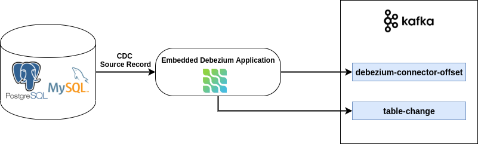

# Embedded Debezium CDC Message Producer

The goal of this project is to demonstrate how to use embedded Debezium to capture the data changes in a database (PostgreSQL / MySQL).

## Tech Stacks
- Embedded Debezium
- Spring Boot
- Kafka
- MySQL / PostgreSQL


## Project Diagram


## Application
`EmbeddedDebeziumApplication` will use the embedded Debezium to 
- obtain CDC source records from a given database (PostgreSQL / MySQL)
- produce messages based on source record which contains the changed database name, the schema name(PostgreSQL specific, MySQL will be blank) and the table's name to topic `table-change`.
- produce "offsets" that define how much of the information the application has processed as a message to topic `debezium-connector-offset`. 
When the application restarts, it will use the last recorded offset to know where in the source information it should resume reading.  
- consume meesage from `table-change` topic and print into the stdout.

## Start environment and Run application
Depending on which database you want to run, you could run either
- PostgreSQL
```shell script
./run.sh postgres
```
or
- MySQL
```shell script
./run.sh mysql
```
in your terminal.

This command will start the whole environment together with the application. 
The environment is running by docker-compose which contains following services: 
- database: `postgres` or `mysql`
- kafka: `zookeeper`, `broker`

The `mysql` and `postgres` will generate a table `author` and insert three rows when it starts.

When everything starts, in the terminal you will see output like:
```shell script
Consumed :: key: postgres.public.author | message Message(database=postgres, schema=public, table=author)
```
It means the test consumer received messages from topic `table-change`.

## Shutdown
Use `Ctrl-C` to stop the application.
Run the command below depending on your database, to stop and remove containers, networks
- PostgreSQL
```shell script
./stop.sh postgres
```
- MySQL
```shell script
./stop.sh mysql
```